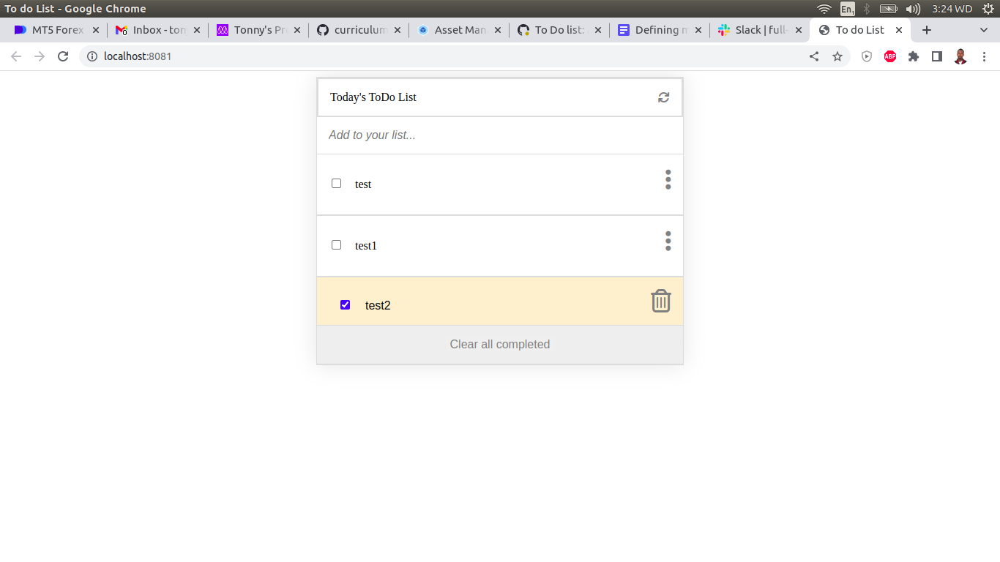

The to do list app helps people to track what they have to do in a day. You can add a new activity with description, remove it and also check it if it is completed.

# To-do-list

> 

## Description the project.
- Create a basic UI using HTML
- build a basic website that allows users to add/remove work activities
- Use Javascript objects and arrays

## Built With

- HTML
- Javascript
- Es6
- Visual Studio Code

<!-- ## Live Demo (if available) -->
<!-- 
[Live Demo Link](https://tonnymuchui.github.io/Awesome-books/) -->

## Getting Started

- To get a local copy up and running follow these simple example steps.

### Prerequisites
- Have a Desktop or Laptop Computer running on with Windows, Mac OS or Linux operating system.
- Have git installed on the Computer
- Have a browser install on the Computer
### Setup
- If it suits you, on your local computer, create a directory in your preferred location (e.g in the Desktop or Document directory)
### Install
- Open your Terminal/Powershell or any command line interface you use, then navigate to your created above directory or the directory you'll like to clone this project directory.
- Type `git clone https://github.com/tonnymuchui/To-do-list.git` if your're using https with git or `git clone git@github.com/tonnymuchui/To-do-list.git` if your preferred is ssh and hit enter.
- Navigate to the `To-do-list` directory on your local computer
- In the terminal, <code>npm init -y</code> to initialise the package manager
Again, in the terminal, <code> npm install </code> to install everything.

### Usage
- You can view the HTML document in your preferred or default browser.
## Authors

👤 **Author1**

- GitHub: [@githubhandle](https://github.com/tonnymuchui)
- Twitter: [@twitterhandle](https://twitter.com/tonnymuchui2)
- LinkedIn: [LinkedIn](https://www.linkedin.com/in/tonny-muchui-murungi-9b549a174/)

## 🤝 Contributing

Contributions, issues, and feature requests are welcome!

Feel free to check the [issues page](../../issues/).

## Show your support

Give a ⭐️ if you like this project!

## Acknowledgments

- Hat tip to anyone whose code was used
- Inspiration
- etc

## 📝 License

This project is [MIT](./LICENSE.MD) licensed.
